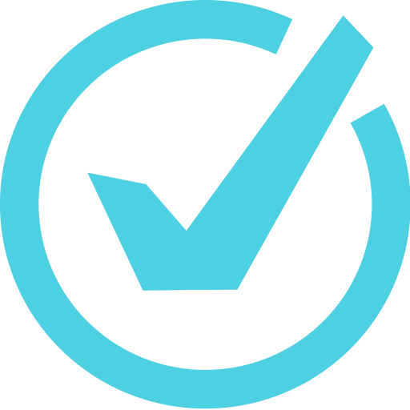
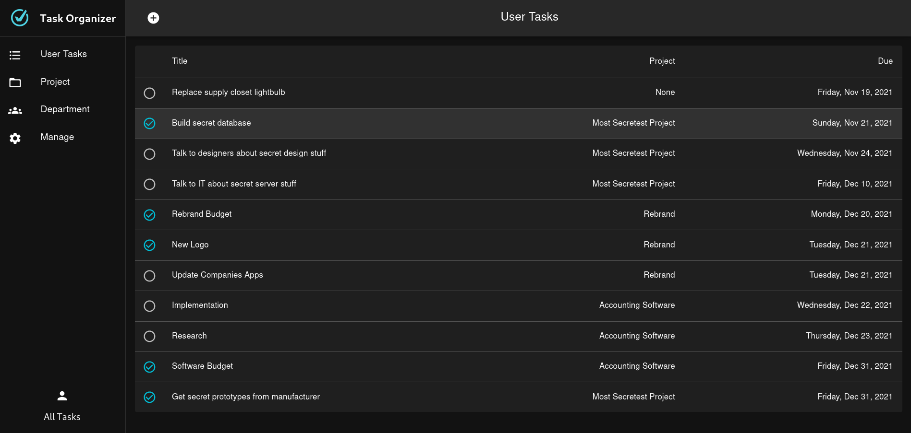
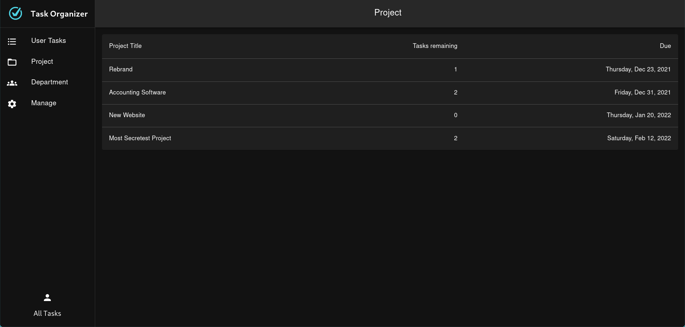
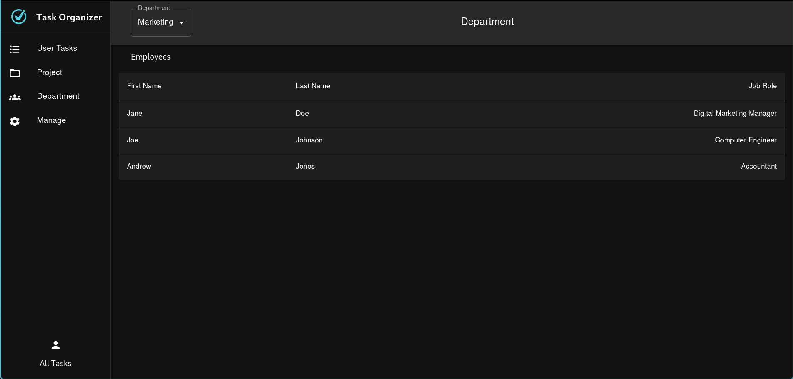

<!--
*** This readme is inspired by the Best-README-Template available at https://github.com/othneildrew/Best-README-Template. Thanks to othneildrew for the inspiration!
-->


<!-- PROJECT SHIELDS -->
<!--
*** I'm using markdown "reference style" links for readability.
*** Reference links are enclosed in brackets [ ] instead of parentheses ( ).
*** See the bottom of this document for the declaration of the reference variables
*** for contributors-url, forks-url, etc. This is an optional, concise syntax you may use.
*** https://www.markdownguide.org/basic-syntax/#reference-style-links
-->
[![Contributors][contributors-shield]][contributors-url]
[![Stargazers][stars-shield]][stars-url]
[![Issues][issues-shield]][issues-url]
[![MIT License][license-shield]][license-url]
<!-- [![Forks][forks-shield]][forks-url] -->


<!-- PROJECT LOGO -->
<br />
<p align="center">
  <a href="https://github.com/bennett-wendorf/SQL-Project">
    
  </a>

  <h1 align="center">Task Organizer</h3>

  <p align="center">
    This is our final project for CS 364: Introduction to Database Management Systems at the University of Wisconsin - La Crosse. It is a small taks management application written in nodejs and react with a mariadb database for storage.
    <br/>
    Authors: Connor Marks and Bennett Wendorf
    <br />
    <a href="https://github.com/bennett-wendorf/SQL-Project"><strong>Explore the docs »</strong></a>
    <br />
    <br />
    <a href="https://github.com/bennett-wendorf/SQL-Project/issues">Report Bug</a>
    ·
    <a href="https://github.com/bennett-wendorf/SQL-Project/issues">Request Feature</a>
  </p>
</p>


<!-- TABLE OF CONTENTS -->
<details open="open">
  <summary>Table of Contents</summary>
  <ol>
    <li>
      <a href="#about-the-project">About The Project</a>
      <ul>
        <li><a href="#built-with">Built With</a></li>
      </ul>
    </li>
    <li>
      <a href="#getting-started">Getting Started</a>
      <ul>
        <li><a href="#installation">Installation</a></li>
      </ul>
    </li>
    <li><a href="#contributing">Contributing</a></li>
    <li><a href="#license">License</a></li>
    <li><a href="#contact">Contact</a></li>
    <li><a href="#acknowledgements">Acknowledgements</a></li>
  </ol>
</details>


<!-- ABOUT THE PROJECT -->
## About The Project

<p align='center'></p>
<p align='center'></p>
<p align='center'></p>

The idea for this project comes largely from something that we, as students and software developers, are intimately familiar with. The need for most individuals and teams to have some way to manage their tasks on a given project, class, or day is something that many if not all students and developers have had to struggle with. Our goal with this project is to create a good solution for managing tasks for whatever use case our users might need. We also included a more overarching idea of a project that tasks can be a part of. This would be especially useful for teams that are working on multiple projects to help them organize what they need to work on and what those individual tasks are a part of. Much of the inspiration for how to format this project comes from Microsoft To Do. Microsoft To Do is a task management software that allows management of tasks for a single user. One of our main goals was to take this idea and expand on it to allow management of tasks for multiple projects as well as teams of people. We chose to implement this as a web app so that it can conceivably be run on cloud infrastructure and be accessed from anywhere. In theory, this structure would also allow us to easily implement a mobile app as a secondary platform for accessing the same data. We wanted to provide a fully functional task management system that one could easily use to provide task and project management functionality for a single user, all the way up to a large team with a clean UI and easy access to all the data one might need.

### Built With

This project is written in Node.js for the backend and React.js for the frontend, with the use of some other packages to aid development. 
* [Node.js](https://nodejs.org/en/)
* [React.js](https://reactjs.org/)
* [React Material Design Library](https://mui.com/)
* [Mariadb](https://mariadb.org/)


<!-- GETTING STARTED -->
## Getting Started

For now, there is no installer or prepackaged installation for this project. Follow the instructions below to get the project running on your system.

### Installation

1. Clone the repo
   ```sh
   git clone https://github.com/Bennett-Wendorf/SQL-Project.git
   ```
2. Install dependencies
    * In the frontend directory use npm to install the requirements for the frontend.
      ```sh
      cd frontend
      npm install
      ```
    * Then do the same for the backend.
      ```sh
      cd ../backend
      npm install
      ```
    OR
    * If you wish to use the application as is, you only need to install the backend requirements, as the `build` directory in the backend will host the pages for the frontend.
3. Run the app
    * If you wish to run the prebuilt frontend from the backend, you can do the following to run the backend server and host the frontend from it.
      ```sh
      cd backend
      npm start
      ```
    OR
    * If you wish to run the backend and frontend separately, do the following in two separate terminals:
      ```sh
      cd frontend
      npm start
      ```
      ```sh
      cd backend
      npm run dev OR npm start
      ```
    
4. Create your own frontend build
    * You can also check out [this guide](https://create-react-app.dev/docs/production-build/) on how to create that build folder if you make modifications to the frontend. 


<!-- CONTRIBUTING -->
## Contributing

Contributions are what make the open source community such an amazing place to be learn, inspire, and create. Any contributions you make are **greatly appreciated**.

1. Fork the Project
2. Create your Feature Branch (`git checkout -b feature/AmazingFeature`)
3. Commit your Changes (`git commit -m 'Add some AmazingFeature'`)
4. Push to the Branch (`git push origin feature/AmazingFeature`)
5. Open a Pull Request

If you find an issue in existing code, feel free to use the above procedure to generate a change, or open an [issue](https://github.com/Bennett-Wendorf/SQL-Project/issues) for me to fix it.


<!-- LICENSE -->
## License

Distributed under the MIT License. See `LICENSE` for more information.


<!-- CONTACT -->
## Contact

Bennett Wendorf - [Website](https://bennett-wendorf.github.io/) - bennettwendorf@gmail.com

Project Link: [https://github.com/Bennett-Wendorf/SQL-Project](https://github.com/Bennett-Wendorf/SQL-Project)


<!-- ACKNOWLEDGEMENTS -->
## Acknowledgements
* [Img Shields](https://shields.io)
* [Node.js](https://nodejs.org/en/)
* [React.js](https://reactjs.org/)
* [React Material Design Library](https://mui.com/)
* [Mariadb](https://mariadb.org/)
* [Create React App](https://create-react-app.dev/)


<!-- MARKDOWN LINKS & IMAGES -->
<!-- https://www.markdownguide.org/basic-syntax/#reference-style-links -->
[contributors-shield]: https://img.shields.io/github/contributors/bennett-wendorf/SQL-Project.svg?style=flat&color=informational
[contributors-url]: https://github.com/bennett-wendorf/SQL-Project/graphs/contributors
[forks-shield]: https://img.shields.io/github/forks/bennett-wendorf/SQL-Project.svg?style=flat
[forks-url]: https://github.com/bennett-wendorf/SQL-Project/network/members
[stars-shield]: https://img.shields.io/github/stars/bennett-wendorf/SQL-Project.svg?style=flat&color=yellow
[stars-url]: https://github.com/bennett-wendorf/SQL-Project/stargazers
[issues-shield]: https://img.shields.io/github/issues/bennett-wendorf/SQL-Project.svg?style=flat&color=red
[issues-url]: https://github.com/bennett-wendorf/SQL-Project/issues
[license-shield]: https://img.shields.io/github/license/bennett-wendorf/SQL-Project.svg?style=flat
[license-url]: https://github.com/bennett-wendorf/SQL-Project/blob/master/LICENSE
